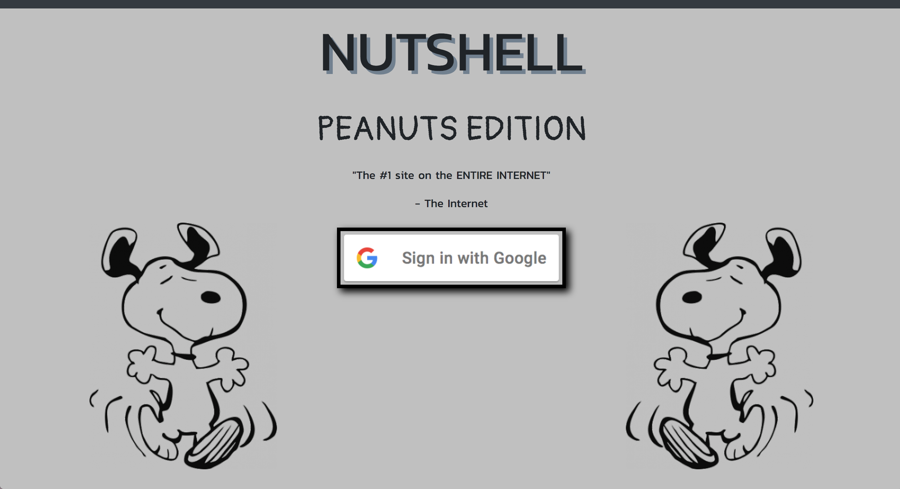
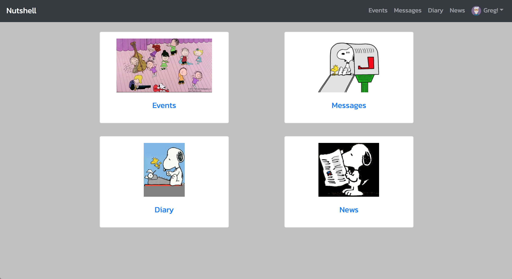
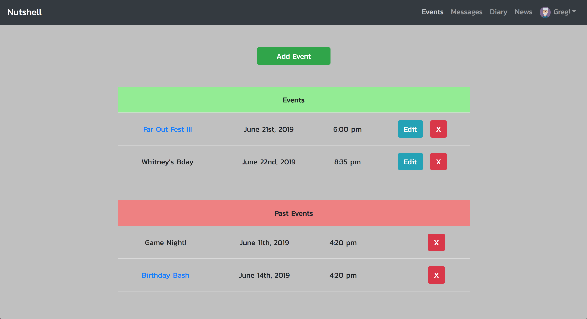
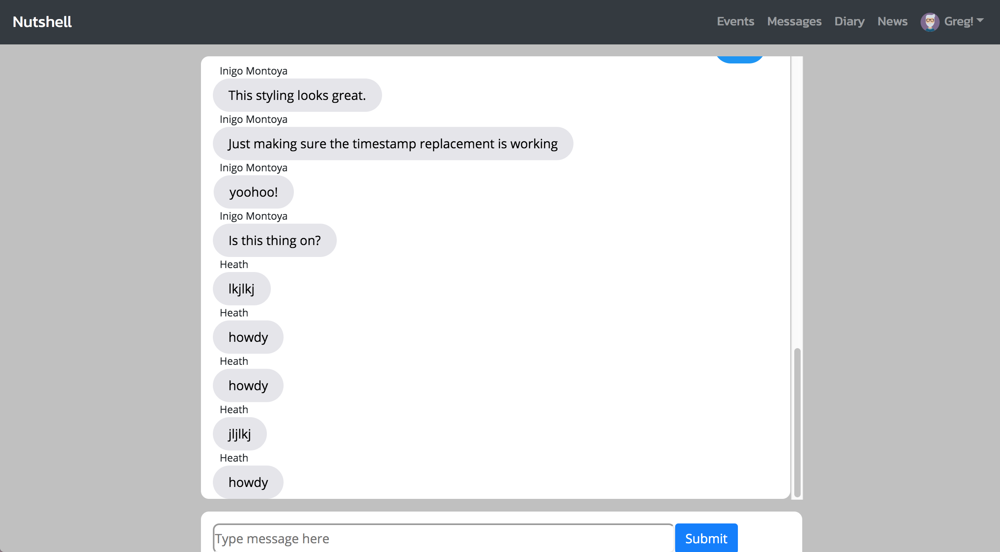
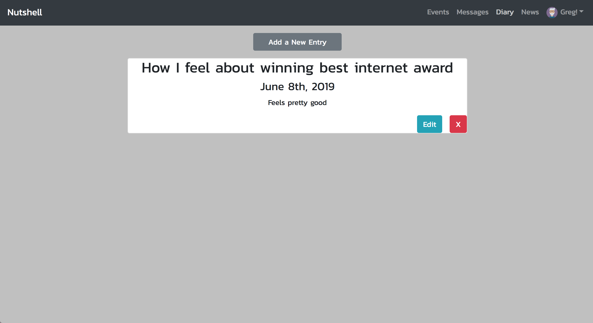
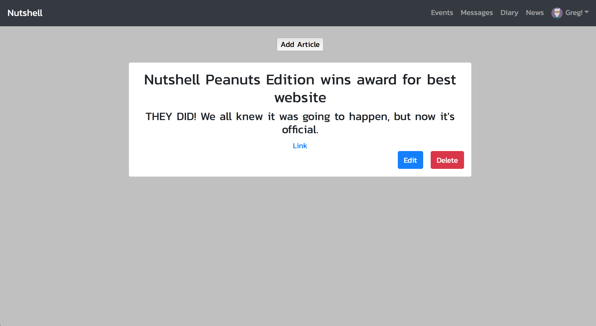
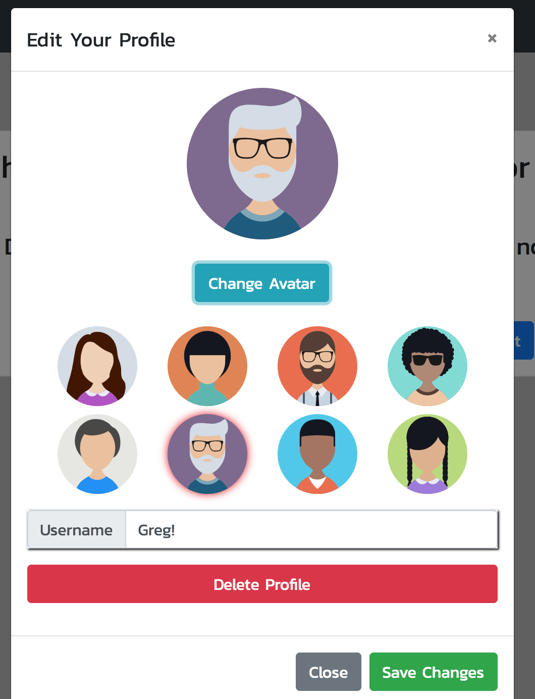

# Nutshell Peanuts Edition

## Description
This is a personal website designed to keep track of four aspects of your life. Events to keep track of current and past events. Messages to message your friends who also have an account with Nutshell. Diary to keep track of your thoughts and feelings. News to keep track of your favorite news stories from around the world!

## Screenshots
* Landing Page

* Dashboard

* Events Page

* Messages Page

* Diary Page

* News Page

* Edit User Page

* Add Event

## How to visit site
* go to "https://nutshell-peanut.firebaseapp.com/"

## Installation Instructions
* Clone down this repo
* At the root of the project, run `npm install`
* Create a firebase project
* Create a database, import the base.json file from `db` folder
* Change rules to ``
{
  "rules": {
    ".read": true,
    ".write": true,
    "event": {
      ".indexOn": "uid"
    },
    "entry": {
      ".indexOn": "uid"
    },
    "article": {
      ".indexOn": "uid"
    },
    "user": {
      ".indexOn": "uid"
    },
    "message": {
      ".indexOn": "uid"
    }
  }
}
``
* Create a new `apiKeys.json` file in the `helpers` folder
* Copy over the information from `apiKeys.example.json` and input that info from your firebase project

## How to run
* In the terminal, type `npm start` to run the webpage.
* If you want to make a production build of this project, type `npm run build`. This will create a folder called build with all of the minified code you need.

## Author
Greg Stephen, Emily Dewitt, Heath Moore, Andrew Tiller